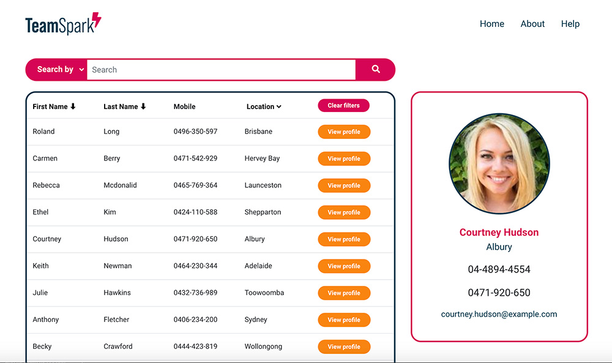

# TeamSpark⚡
This full stack web application uses a remote server and database to manage a list of burgers submitted by users. The users can interact with the front end to create new items in the database and update existing items.
[See deployed application.](http://ferwicker.com/team-spark/)
[See project page on my portfolio.](http://ferwicker.com/projects/team-spark/)

 # Table of contents
 - [Motivation](#motivation)
 - [Built with](#built-with)
 - [Features](#features)
 - [Installation](#installation)
 - [Roadmap](#roadmap)
 - [Credits](#credits)

## Motivation
With workplaces changing rapidly and more people working from home or remotely than ever before, organisations need a way to easily access everyone's contact details to make day to day communication easier. TeamSpark⚡ aims to facilitate this with a central company directory that everyone in the organisation can access.

## Built with
- [React](https://reactjs.org/)
- [Bootstrap](https://getbootstrap.com/)
- [Random User API](https://randomuser.me/)
- [Adobe XD (prototyping)](https://www.adobe.com/au/products/xd.html)

## Features
Display the team list on a table with the main fields always visible, view each person's full details, search employees by first name, last name or city, filter the table by state and sort by either first or last name.
###  [See deployed application.](http://ferwicker.com/team-spark/)

## Installation
To install this application locally, download the package, then install the necessary dependencies by navigating to the application folder in your terminal and running `npm install`. Now you are ready, start the server from the folder using `npm start` command. When the connection is established, visit `http://localhost:3000/` from your browser to go to the application.

## Roadmap
Future updates for this application include user logins, adding your own database of employees and having more useful fields to search and filter from.

## Credits
- Fonts sourced from [Adobe Fonts](https://fonts.adobe.com/)
- All icons from <a href="https://fontawesome.com/" title="Fontawesome">Fontawesome</a>
- Users generated from: https://randomuser.me/
